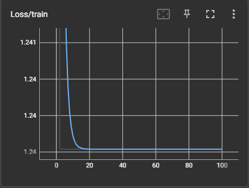
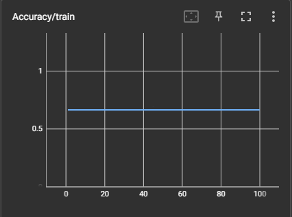
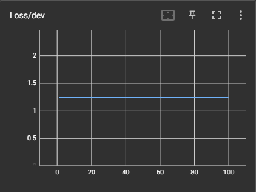
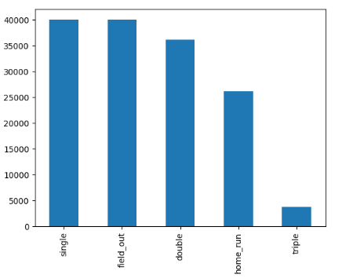
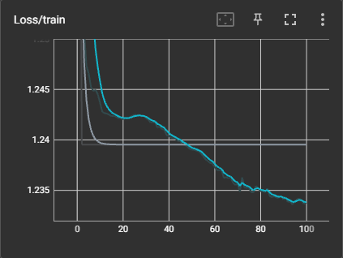
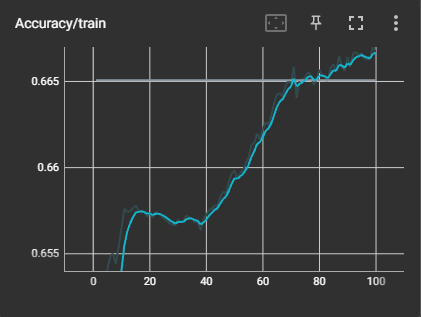
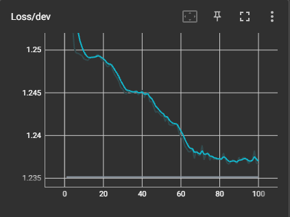
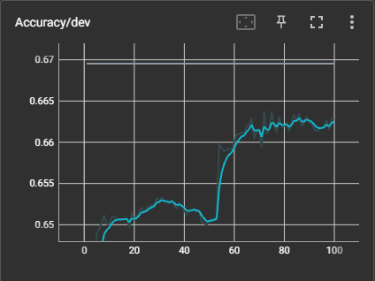

# Predict At Bat Outcomes
Baseball has always been a cutting edge sport in regards to analytics. More and more predictive analytics is being used to improve player performance and team decision making. In the spirit of that, this project aims to give better insight on the quality of a hit by training a neural network to predict the outcome of an at bat, based on the pitch velocity, exit velocity, and launch angle.

# Table of Contents
1. [Data](#data)
2. [Models](#models)
    1. [v1.0](#v1.0)
    2. [v2.0](#v2.0)

# Data
The dataset is every player who was active in 2020's at bats from 2015 - 2020. This totals 778,449 rows of data, almost all of which are very high quality. The data was acquired via another program I've written, that scrapes baseball statistics off of various sites ([mlb.com](https://www.mlb.com), [fangraphs](https://www.fangraphs.com), [baseballsavant](https://www.baseballsavant.mlb.com), etc.) and saves them for later use. These particular statistics (pitch velo, exit velo, and launch angle) were scraped from [baseballsavant](https://www.baseballsavant.mlb.com).

# Models
This model has been through multiple iterations. Each iteration trained on either the entire or a subset of the data described above, then training and error analysis were performed to identify areas of improvement. These improvements were implemented and the model was trained again.

## v1.0
This, the first end-to-end training of the model, had a very simple structure to it, in order to get a clearer idea of the most effective direction to go next.

### Data

#### Changes
Very little was done to the data for this exploratory iteration.

- Smaller quantity columns like `fielders_choice` and `triple_play` were rolled up into `field_out`.
- Since the goal is to classify batted balls, all no-contact plays were droped (strikeouts, walks, etc.).
- The data was all normalized on the training set's mean and standard deviation, to improve training times and quality.

#### Classes
This left the data with 536,712 rows and five unique labels:
- field_out
- single
- double
- triple
- home_run

#### Distribution
A known issue going into this iteration is that the distribution of the data is **heavily** skewed. Two thirds of the data are labeled `field_out` on the high end and on the low end `triple` made up 0.7% of the data. The expectation is this will create heavy bias, potentially even reducing multiple labels to zero predictions.

#### Split
The data was split 90/5/5 between the train, dev, and test sets.

### Neural Network
| Layer | Input Nodes | Output Nodes | Function |
|:-----:|:-----------:|:------------:|----------|
| 1     | 3           | 32           | ReLU     |
| 2     | 32          | 64           | ReLU     |
| 3     | 64          | 128          | ReLU     |
| 4     | 128         | 128          | ReLU     |
| 5     | 128         | 64           | ReLU     |
| 6     | 64          | 32           | ReLU     |
| 7     | 32          | 5            | Softmax  |

### Hyperparameters
| H-param       | Value              |
|---------------|--------------------|
| Split         | 90/5/5             |
| Loss          | Cross Entropy Loss |
| Optimizer     | Adam               |
| Learning Rate | 0.001              |
| Epochs        | 100                |
| Batch Sizes   | 3,000              |

### Training
After training for 100 epochs, the training loss flattened out almost immediatley and all of the dev loss, dev accuracy, and train accuracy did not change at all.

| Loss | Accuracy |
|:----:|:--------:|
|  |  |
|  |  |

#### Final Evaluation on the test set
| Loss   | Accuracy |
|:------:|:--------:|
| 0.9048 | 0.66     |

### Evaluation
It is immediately apparent that there is some fundamental flaw with this iteration and only a little more digging reveals the truth. For almost every row of data, train, dev, or test, the model predicted `field_out`. Unsurprisingly, this gave the model ~0.66 accuracy for each dataset, since field outs make up two thirds of the data.

While there are other obvious areas to improve the model, it seems data distribution is by far the most pressing issue, as it will measurably impact every future model if not dealt with first. It also eschews the need to continue evaluating this model by other means (precision, recall, etc.), because there is not point overwhelming the second iteration with "to-do's".

The one benefit of this result is it begins to elucidate the target goal. Since there is no data evaluated by other means (eg. how well a heuristic model performs or how well a human can perform the task), this project lacks a "true" target goal of performance. At least now it is clear that one of the worst possible models will be correct 2 out of 3 times.

## v2.0
This iteration aims to shed more light on the best solution for the data distribution problem uncovered by [v1.0](#v1.0).

### Data

#### Changes
Because of the heavy skewness towards field outs and singles, in the original dataset (which in the context of baseball makes sense, but severely hurts modeling), this version aims to remedy the problem by redistributing the data, at the cost of a reduction of total samples.

- The same initial cleaning steps were taken as in [v1.0](#v1.0)
- Random samples labeled `field_out` or `single` were removed until each label had no more than 40,000 samples.
    - This reduced the total sample size from ~500,000 rows to ~146,000.

#### Classes
Remained the same five classes as [v1.0](#v10)

#### Distribution
With the data redistributed, as outlined above, the data is much more inline with acceptable distribution expections. Field outs and singles make up 27% of the data each, while doubles are 25% and home runs 18%. Triples are still the noticeable outlier at 2.5%, but that will be addressed after the impact of this redistribution can be measured.

#### Split
With the loss of a fair bit of data, the split was updated to be more accomodating to 80/10/10.

### Neural Network
| Layer | Input Nodes | Output Nodes | Function |
|:-----:|:-----------:|:------------:|----------|
| 1     | 3           | 32           | ReLU     |
| 2     | 32          | 64           | ReLU     |
| 3     | 64          | 128          | ReLU     |
| 4     | 128         | 128          | ReLU     |
| 5     | 128         | 64           | ReLU     |
| 6     | 64          | 32           | ReLU     |
| 7     | 32          | 5            | Softmax  |

### Hyperparameters
| H-param       | Value              |
|---------------|--------------------|
| Split         | 80/10/10           |
| Loss          | Cross Entropy Loss |
| Optimizer     | Adam               |
| Learning Rate | 0.001              |
| Epochs        | 100                |
| Batch Sizes   | 3,000              |

### Training
After training for 100 epochs, ...

| Loss | Accuracy |
|:----:|:--------:|
|  |  |
|  |  |

#### Final Evaluation on the test set
| Loss   | Accuracy |
|:------:|:--------:|
| 0. | 0.     |

### Evaluation

