# Predict At Bat Outcomes
Baseball has always been a cutting edge sport in regards to analytics. More and more predictive analytics is being used to improve player performance and team decision making. In the spirit of that, this project aims to give better insight on the quality of a hit by training a neural network to predict the outcome of an at bat, based on the pitch velocity, exit velocity, and launch angle.


# Table of Contents
1. [Data](#data)
    1. [Dataset for Versions 1.X - 4.X](#dataset-for-versions-1x---4x)
        - [Features](#features-v40)
        - [Label Distribution](#label-distribution-v40)
        - [Results by EV and LA](#results-by-exit-velocity-and-launch-angle-v40)
    2. [Dataset for Versions 5.X+](#dataset-for-versions-5x)
        - [Features](#features-v50)
        - [Label Distribution](#label-distribution-v50)
        - [Results by EV and LA](#results-by-exit-velocity-and-launch-angle-v50)
2. [Summary](#summary)
3. [Models](#models)
    1. [v1.0](#v10)
    2. [v2.0](#v20)
    3. [v2.1](#v21)
    4. [v3.X](#v3x)
    5. [v4.1](#v41)
    6. [v5.0](#v50)
    7. [v5.1](#v51)


# Data
## Dataset for Versions 1.X - 4.X
The dataset is every player who was active in 2020's at bats from 2015 - 2020. This totals 778,449 rows of data, almost all of which are very high quality. The data was acquired via another program I've written, that scrapes baseball statistics off of various sites ([mlb.com](https://www.mlb.com), [fangraphs](https://www.fangraphs.com), [baseballsavant](https://www.baseballsavant.mlb.com), etc.) and saves them for later use. That python program is called [baseball-spider](). These particular statistics were scraped from [baseballsavant](https://www.baseballsavant.mlb.com).

### Features (v4.0+)
| 1 | 2 | 3 | 4 | 5 |
|---|---|---|---|---|
| exit_velocity | launch_angle | ft/s (hitter speed) | pitch_velocity | direction |

### Label Distribution (v4.0+)

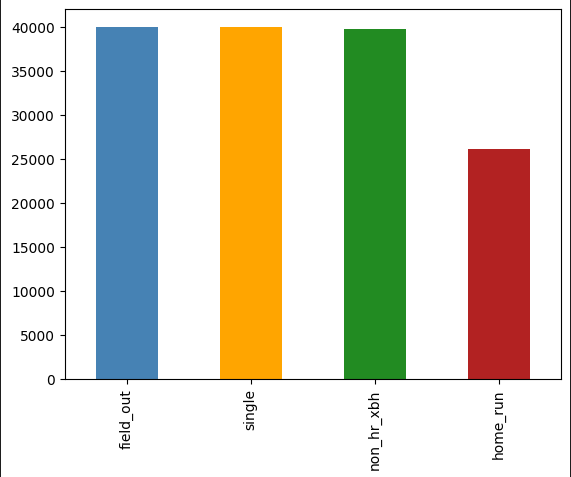

### Results by Exit Velocity and Launch Angle (v4.0+)
The two main drivers of hit results are exit velocity and launch angle, so their relationship to the results is an important aspect to understand.

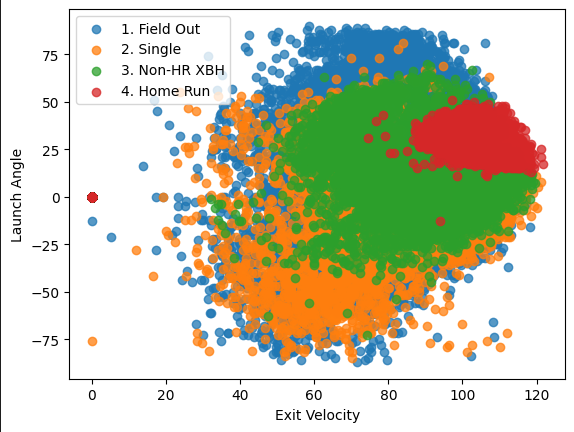


## Dataset for Versions 5.X+
This dataset was gathered in my desire to get more robust horizontal launch angle features for my dataset. It was gathered via the [pybaseball](https://github.com/jldbc/pybaseball) library; a python library created by James LeDoux and his colleagues. This dataset was then joined with the statcast running data `baseball-spider` gathered.

This library bears many similarities to `baseball-spider`, in regards to the type of data it gathers for this project (pitch level data), with its two key differences being:
1. It gathers data for **every** pitch, not just the end-result pitch of an at-bat.
2. It gathers the data via [baseballsavant's Statcast Search CSV data downloads](https://baseballsavant.mlb.com/csv-docs) functionality, rather than webscraping, like baseball-spider.

The full dataset has 5,479,762 rows, but since the focus is on in-play events, the tapered down dataset has 959,011  rows. There are three reasons this dataset is larger than `baseball-spider`'s:
1. It contains data for 2015-2022, rather than just 2015-2020.
2. I missed some `mlb_ids` when originally gathering the data with `baseball-spider`, so some players are missing.
3. The `pybaseball` data includes spring training, exhibition, and playoff games.

This data has significantly more features to potentially use, so it offers a good opportunity to test and tune the data on larger feature sets. The two columns I would like to highlight most for this purpose are `hc_x` and `hc_y`. These two columns represent the X and Y pixel coordinates of the ball's location on MLB's map of the field. Using these two coordinates and some rough-and-tumble math, we can estimate the horizontal launch angle. Bill Petti, in his [Statcast-Modeling](https://github.com/BillPetti/Statcast-Modeling) project, provides a formula that he uses as a rough estimation for this calculation. It is an imperfect formula, as you will find that it will, on occasion, put balls in incorrect positions (eg. in foul territory when it was a fair ball), but it is consistent enough where I believe it will serve this project's purposes.
```tan((hc_x - 128) / (208 - hc_y)) * 180 / pi * 0.75```

### Features (v5.0+)
| 1 | 2 | 3 | 4 | 5 | 6 | 7 | 8 | 9 | 10 | 11 |
|---|---|---|---|---|---|---|---|---|----|----|
| exit_velocity | la_z | la_xy | ft/s (hitter speed) | effective_speed (pitch velo) | release_spin | zone | stand (batter side) | p_throws (pitcher's hand) | if_fielding_alignment | of_fielding_alignment |

### Label Distribution (v5.0+)

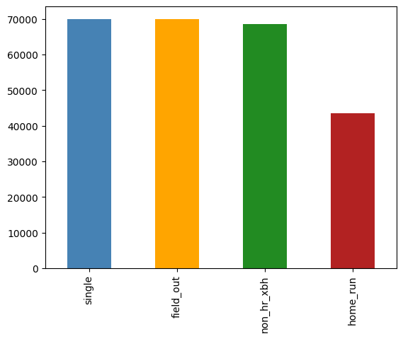

### Results by Exit Velocity and Launch Angle (v5.0+)
The two main drivers of hit results are exit velocity and launch angle, so their relationship to the results is an important aspect to understand.

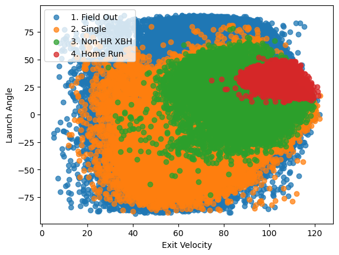


# Summary
Up to this point 14 iterations have been tested, each one bringing a new feature to the model (whether it be a new hyperparameter, more data, transformed data, etc.). The best performing model at this time is [version 5.1](#v51), with an accuracy hovering around 76%. Before v5.X, development began to stagnate because the data source was simply not robust enough. Many efforts were made to improve the original data source, such as: redistributing label ratios ([v2.0](#v20)), combining similar labels ([v2.1](#v21)), and joining it with new data sources ([v4.1](#v41)). None of these changes were able to improve the model in any measurable way; the earliest iterations, up to v4.1, all were within 2% of each other in accuracy.

When data transformations brough little improvement, model improvements and hyperparamter tuning became the focus for a time. Unfortunately, this too saw little significant improvement in the model.

It wasn't until v5.1 that the model saw a dramatic improvement, because of switching to a new data source. This [data source](#dataset-for-versions-5x) was larger, had more features, but maintained the consistency and quality as my original source. This source, coupled with longer training, and a larger model proved to be catalyst needed to push this model into a more high-performing state.

In short, at this point in the project's life, increased complexity was the key to improved model performance. Sometimes complexity can hurt a neural network, but when the dataset is too simple you are not leveraging the most advantageous aspects of neural networks.

## Evaluation Performance by Iteration
|            | Test Loss | Test Accuracy |
|-----------:|-----------|---------------|
|[v1.0](#v10)| 0.9048    | 66%           |
|[v2.0](#v10)| 0.9048    | 67%           |
|[v2.1](#v10)| 1.6680    | 68%           |
|[v3.0](#v3x)| 0.7438    | 69%           |
|[v3.1](#v3x)| 1.7436    | 67%           |
|[v3.2](#v3x)| 1.7357    | 68%           |
|[v3.3](#v3x)| 1.7419    | 68%           |
|[v3.4](#v3x)| 0.7440    | 68%           |
|[v3.5](#v3x)| 1.7468    | 67%           |
|[v3.6](#v3x)| 1.3459    | 68%           |
|[v4.0](#v41)| 0.7438    | 68%           |
|[v4.1](#v41)| 0.7451    | 69%           |
|[v5.0](#v50)| 1.7224    | 67%           |
|[v5.1](#v51)| 1.1501    | 76%           |


# Models
This model has been through multiple iterations. Each iteration trained on either the entire or a subset of the data described above, then training and error analysis were performed to identify areas of improvement. These improvements were implemented and the model was trained again.

## v1.0
This, the first end-to-end training of the model, had a very simple structure to it, in order to get a clearer idea of the most effective direction to go next.

### Data

#### Changes
Very little was done to the data for this exploratory iteration.

- Smaller quantity columns like `fielders_choice` and `triple_play` were rolled up into `field_out`.
- Since the goal is to classify batted balls, all no-contact plays were droped (strikeouts, walks, etc.).
- The data was all normalized on the training set's mean and standard deviation, to improve training times and quality.

#### Classes
This left the data with 536,712 rows and five unique labels:
- field_out
- single
- double
- triple
- home_run

#### Distribution
A known issue going into this iteration is that the distribution of the data is **heavily** skewed. Two thirds of the data are labeled `field_out` on the high end and on the low end `triple` made up 0.7% of the data. The expectation is this will create heavy bias, potentially even reducing multiple labels to zero predictions.

#### Split
The data was split 90/5/5 between the train, dev, and test sets.

### Neural Network
| Layer | Input Nodes | Output Nodes | Function |
|:-----:|:-----------:|:------------:|----------|
| 1     | 3           | 32           | ReLU     |
| 2     | 32          | 64           | ReLU     |
| 3     | 64          | 128          | ReLU     |
| 4     | 128         | 128          | ReLU     |
| 5     | 128         | 64           | ReLU     |
| 6     | 64          | 32           | ReLU     |
| 7     | 32          | 5            | Softmax  |

### Hyperparameters
| H-param       | Value              |
|---------------|--------------------|
| Split         | 90/5/5             |
| Loss          | Cross Entropy Loss |
| Optimizer     | Adam               |
| Learning Rate | 1e-3              |
| Epochs        | 100                |
| Batch Sizes   | 3,000              |

### Training
After training for 100 epochs, the training loss flattened out almost immediatley and all of the dev loss, dev accuracy, and train accuracy did not change at all.

| Loss | Accuracy |
|:----:|:--------:|
|  |  |
|  |  |

#### Final Evaluation on the test set
| Loss   | Accuracy |
|:------:|:--------:|
| 0.9048 | 0.66     |

### Evaluation
It is immediately apparent that there is some fundamental flaw with this iteration and only a little more digging reveals the truth. For almost every row of data, train, dev, or test, the model predicted `field_out`. Unsurprisingly, this gave the model ~0.66 accuracy for each dataset, since field outs make up two thirds of the data.

While there are other obvious areas to improve the model, it seems data distribution is by far the most pressing issue, as it will measurably impact every future model if not dealt with first. It also eschews the need to continue evaluating this model by other means (precision, recall, etc.), because there is not point overwhelming the second iteration with "to-do's".

The one benefit of this result is it begins to elucidate the target goal. Since there is no data evaluated by other means (eg. how well a heuristic model performs or how well a human can perform the task), this project lacks a "true" target goal of performance. At least now it is clear that one of the worst possible models will be correct 2 out of 3 times.


## v2.0
This iteration aims to shed more light on the best solution for the data distribution problem uncovered by [v1.0](#v10).

### Data

#### Changes
Because of the heavy skewness towards field outs and singles, in the original dataset (which in the context of baseball makes sense, but severely hurts modeling), this version aims to remedy the problem by redistributing the data, at the cost of a reduction of total samples.

- The same initial cleaning steps were taken as in [v1.0](#v10)
- Random samples labeled `field_out` or `single` were removed until each label had no more than 40,000 samples.
    - This reduced the total sample size from ~500,000 rows to ~146,000.

#### Classes
Remained the same five classes as [v1.0](#classes)

#### Distribution
With the data redistributed, as outlined above, the data is much more inline with acceptable distribution expections. Field outs and singles make up 27% of the data each, while doubles are 25% and home runs 18%. Triples are still the noticeable outlier at 2.5%, but that will be addressed after the impact of this redistribution can be measured.


#### Split
With the loss of a fair bit of data, the split was updated to be more accomodating to 80/10/10.

### Neural Network
| Layer | Input Nodes | Output Nodes | Function |
|:-----:|:-----------:|:------------:|----------|
| 1     | 3           | 32           | ReLU     |
| 2     | 32          | 64           | ReLU     |
| 3     | 64          | 128          | ReLU     |
| 4     | 128         | 128          | ReLU     |
| 5     | 128         | 64           | ReLU     |
| 6     | 64          | 32           | ReLU     |
| 7     | 32          | 5            | Softmax  |

### Hyperparameters
| H-param       | Value              |
|---------------|--------------------|
| Split         | 80/10/10           |
| Loss          | Cross Entropy Loss |
| Optimizer     | Adam               |
| Learning Rate | 1e-3              |
| Epochs        | 100                |
| Batch Sizes   | 1,000              |

### Training
After training for 100 epochs, the model showed a much more expected progressions in both train and dev loss/accuracy. The margins are very small for the following, but training loss/acc both surpassed v1.0, but dev did not.

| Loss | Accuracy |
|:----:|:--------:|
|  |  |
|  |  |

#### Final Evaluation on the test set
| Loss   | Accuracy |
|:------:|:--------:|
| 0.9048 | 0.67     |

### Evaluation
The results seem nearly identical at first glance (the losses are identical and the accuracies only have a 0.01 difference), but this model was much more encouraging to see than v1.0.

The first positive sign are the loss and accuracy graphs shown above. They indicate that the model was actually learning each epoch and may have continued learning if training was extended. That being said, learning was slow, which is something worth looking into in the future.

The second piece of good news was the labeling of the test dataset. Rather than 100% of predictions being field outs, we have the below distribution:

| Label     | Total Samples | Accuracy |
|-----------|:-------------:|:--------:|
| field_out | 3,988         | 71.61%   |
| single    | 4,013         | 69.75%   |
| double    | 3,628         | 49.72%   |
| home_run  | 2,618         | 89.08%   |
| triple    | 344           | 0.0%     |

This reaffirms the information gotten from the loss graphs, that the model was actually learning to label. It also provides insight on next steps.

First is the question of triples. There are simply so few of them and they are very similar to doubles, that in their current state it will be very hard to get the model to learn them. It's impractical reduce the rest of the results down to the triple level, like done with11 field outs and singles, which leaves: synthetic samples, combining them with another label, removing them, or more data.

More data is going to be a time-intensive task and, even though it might be the option that could show the most improvement (since triples are heavily tied to player speed), the time required to get the data might not be worth improving the least common hit. Synthetic samples *might* show some improvement, but again, they're very similar to doubles, so this might be only a very small improvement or just confuse doubles. Removing them is not an unreasonable option and it would eliminate any issue they might have, but combining them to doubles and changing the label to something akin to "non_hr_xbh", might be the best option for the model long term and prevent us from losing more samples.

The other key insight this version gives us is that we need to increase learning speed, but to prevent oscillation around the minima, we should implement momentum or something similar in tandem with increasing learning rate (Adam already being used may be enough, but that will have to be tested).


## v2.1
This iteration will measure the effects of combining doubles and triples and increasing training to 300 epochs.

### Data

#### Changes
As mentioned in the [v2.0 evaluation](#evaluation-1), doubles and triples will be combined into `non_hr_xbh`. No other changes will be made to the data, in order to measure the effects.

- The same initial cleaning steps were taken as in [v1.0](#v10) and [v2.0](#v20)
- Results equal to `triple` were renamed to `double`, then `double` was renamed to `non_hr_xbh`.

#### Classes
With triples and doubles combined, now there are only 4 labels.
- field_out
- single
- non_hr_xbh
- home_run

#### Distribution
Non-HR XBHs now make up 27% of the data, which makes that label equal in size to field outs and singles, with home runs still at 18%.

#### Split
The same as [v2.0](#v20) 80/10/10.

### Neural Network
| Layer | Input Nodes | Output Nodes | Function |
|:-----:|:-----------:|:------------:|----------|
| 1     | 3           | 32           | ReLU     |
| 2     | 32          | 64           | ReLU     |
| 3     | 64          | 128          | ReLU     |
| 4     | 128         | 128          | ReLU     |
| 5     | 128         | 64           | ReLU     |
| 6     | 64          | 32           | ReLU     |
| 7     | 32          | 4            | Softmax  |

### Hyperparameters
| H-param       | Value              |
|---------------|--------------------|
| Split         | 80/10/10           |
| Loss          | Cross Entropy Loss |
| Optimizer     | Adam               |
| Learning Rate | 1e-3               |
| Epochs        | 300                |
| Batch Sizes   | 1,000              |

### Training
After training for 300 epochs, the model showed measured improvements over v2.0, albeit on a small scale. The majority of improvements happened early, making the difference of adding 200 additional epochs negligible.

(pink=v2.1; blue=v2.0)
| Loss | Accuracy |
|:----:|:--------:|
|  |  |
|  |  |

#### Final Evaluation on the test set
| Loss   | Accuracy |
|:------:|:--------:|
| 1.6680 | 0.68     |

### Evaluation
This minor update proved to be another step in the right direction. As seen above, the train/dev loss/acc all markedly improved over v2.0. That being said, there are some takeaways that require attention.

1. The test loss was 1.6680, higher than any other version and 0.5 greater than the train and dev losses.

This could indicate potential bias, but also because the dev loss was inline with the training results and tests accuracy was consistent with train, there's a possibility this was an abberation and training again might produce more acceptable results.

2. The improvements, while good, are still marginal.

This isn't wholly unsurprising, because the only change was combining doubles and triples. At most (because triples made up 2.5% of the labels), accuracy could improve by 0.025, so the 0.01... change seen is in line with that expectation.

This being said, marginal improvements shouldn't be the goal. It's time to focus more are larger gains, which may mean next iteration will be learning rate focused.

3. Non-HR XBHs still face a labeling problem.

Looking at the below test accuracies, non-HR XBHs are the worst performer at ~50% accurate.

| Label      | Total Samples | Accuracy |
|------------|:-------------:|:--------:|
| field_out  | 4,002         | 76.84%   |
| single     | 4,022         | 67.73%   |
| non_hr_xbh | 3,935         | 50.62%   |
| home_run   | 2,632         | 83.02%   |

Improving that number should be a priority, since home runs are in a very strong spot and singles/field outs are expected to have a harder time at telling each other apart. This means following iterations will need to dive deeper into which non-HR XBHs are having the most issues and why.

4. Moving forward, while looking for areas of improvement, the possibility of already being near the ceiling needs to be entertained.

While not a scenario anyone would want, the possibility that 65-70% accuracy being the best this model will ever be able to achieve with this data is real. With only three features (pitch velo being one I'm not confident actually helps the model), lack of robust features may be the biggest blocker this model faces. Player speed, horizontal launch angle, park, opposing defense, etc. are all potentially helpful features for this model that will either take a lot of time to gather or are simply not available to the public. Trying to improve the model in other, less time-intensive ways is the correct approach for now, but it is smart to continue assessing the situation so that efforts are not in vain.

The next version will focus most on improving #2, #3, or both as those seem like the biggest potential improvement areas right now.


## v3.X
Versions 3.X aimed to optimize model performance through hyperparameter tuning and model infrastructure.

### Data

#### Changes
Input data will remain the same as it was in [v2.1](#changes-2).

#### Classes
Remains the same as [v2.1](#classes-2).

#### Distribution
Remains the same as [v2.1](#distribution-2).

#### Split
The same as [v2.1](#split-2).

### Neural Network
| Layer | Input Nodes | Output Nodes | Function |
|:-----:|:-----------:|:------------:|----------|
| 1     | 3           | 32           | ReLU     |
| 2     | 32          | 64           | ReLU     |
| 3     | 64          | 32           | ReLU     |
| 4     | 32          | 4            | Softmax  |

### Hyperparameters
| H-param       | Value              |
|---------------|--------------------|
| Split         | 80/10/10           |
| Loss          | Cross Entropy Loss |
| Optimizer     | Adam               |
| Learning Rate | 3e-3               |
| Epochs        | 100                |
| Batch Sizes   | 1,000              |
| Weight Decay  | 1e-4               |
| Scheduler     | OneCycleLR         |
| Max LR        | 1e-2               |

### Training
After training seven different model versions for 100 epochs each, almost all versions showed some degree of improvement over previous iterations. Unfortunately, all these improvements were very tiny and would be considered insignificant by most.

(each line represents one of the seven 3.X models that were trained)
| Loss | Accuracy |
|:----:|:--------:|
| 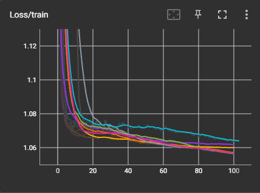 | 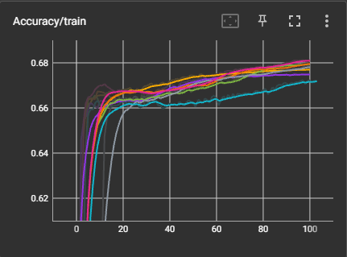 |
| 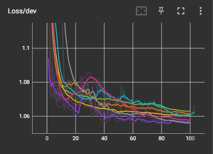 | 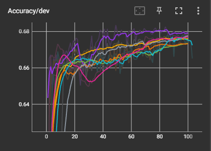 |

#### Final Evaluation on the test set
| Loss   | Accuracy |
|:------:|:--------:|
| 1.3459 | 0.68     |

### Evaluation
There are a few small things left to try, but the "lack of data" wall is looming. After aggressively boosting the LR (up to 5x in original size in some versions), incorporating OneCycleLR (to boost LR even higher), adding weight decay to Adam to reduce minima oscillation, and tuning the batch sizes, the model is still unable to break through the elusive 70% accuracy threshold. Reducing the model size to only four layers also showed very little cost in performance, which confirms something that is already known, the data is extremely simple.

A next step could be a deep dive into the existing data, in an attempt to understand the labeling errors and their frequencies, but I have a strong suspicion that I know the answer to these questions already. I am now of the firm belief that only a more robust dataset would show measurable improvements to the model.

I do believe this current model could outperform a human who was also only given the three features this model is trained on (as seen below, it's hard to imagine a person correctly ID'ing 3/4s of singles), but I don't consider human-level performance to be an acceptable metric for this specific problem. For one, non-HR XBHs must be able to get higher than 52% accuracy.

| Label      | Total Samples | Accuracy |
|------------|:-------------:|:--------:|
| field_out  | 3,989         | 64.80%   |
| single     | 3,965         | 76.47%   |
| non_hr_xbh | 3,973         | 52.88%   |
| home_run   | 2,664         | 84.95%   |

This means the only reasonable next step is to begin gathering new data with a more robust feature set. This will take an unknown amount of time; the original data gathering project had ever-evolving issues and two years have probably only increased the number of those issues. As such, this project will be on temporary hold, until the web-scraping project, fondly named "Baseball Spider", can be revamped for a new era.


## v4.1
Version 4.0 (and subsequently v4.1) incorporates new features into the model, with the aim that new features will push the model past the 70% accuracy threshold.

### Data

#### Changes
Input data has added two new columns to the feature set: `direction` and `ft/s`.

##### Direction
Direction is simply the direction the ball was hit ("pull", "straightaway", and "opposite"). This three-class format is somewhat elementary and not nearly as granular as I would like, but it has proven difficult to acquire anything more robust for this feature.

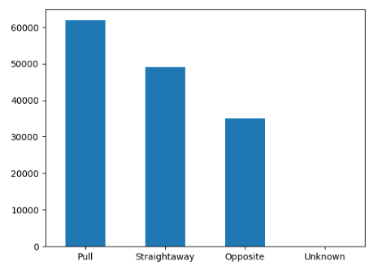

Note: These string labels will be factorized for training.

##### Feet per second
Feet per second (ft/s), represents the hitter's average speed over the year. It is a scalar ranging from 0 to ~30. Not every sample has this feature, but enough do where I don't consider it an issue.

| Stat | Value |
|------|:-----:|
| Mean | 26.9  |
| Std  | 2.66  |
| Min  | 0.0   |
| Max  | 30.9  |

There are more features able to be added at this time, but ingesting new features in batches, to better assess the performance of the new features, is the best approach for v4.0/1.

#### Classes
Remains the same as [v2.1](#classes-2).

#### Distribution
Remains the same as [v2.1](#distribution-2).

#### Split
The same as [v2.1](#split-2).

### Neural Network
| Layer | Input Nodes | Output Nodes | Function |
|:-----:|:-----------:|:------------:|----------|
| 1     | 5           | 32           | ReLU     |
| 2     | 32          | 64           | ReLU     |
| 3     | 64          | 32           | ReLU     |
| 4     | 32          | 4            | Softmax  |

### Hyperparameters
| H-param       | Value              |
|---------------|--------------------|
| Split         | 80/10/10           |
| Loss          | Cross Entropy Loss |
| Optimizer     | Adam               |
| Learning Rate | 3e-3               |
| Epochs        | 1,000              |
| Batch Sizes   | 1,000              |
| Weight Decay  | 1e-4               |
| Scheduler     | OneCycleLR         |
| Max LR        | 1e-2               |

### Training
After training v4.0 on 100 epochs, then v4.1 with the same hyperparameters and 1,000 epochs, there was no measurable improvement to the model due to the new features. Version 4.1 did show marginal improvment overall, due to it being trained on 1,000 epochs instead of 100, but again these improvement were small in comparison to the goal. 

(v4.1 is the long, purple line. All other lines are the previous models for comparison.)
| Loss | Accuracy |
|:----:|:--------:|
| 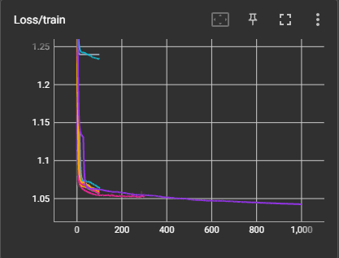 | 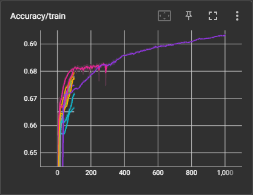 |
| 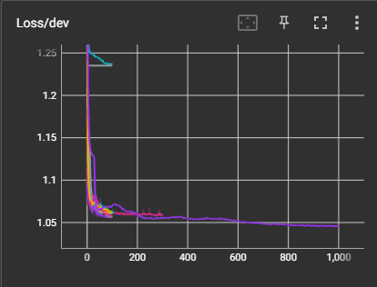 | 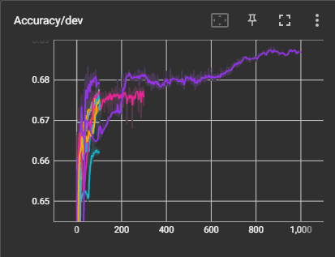 |

#### Final Evaluation on the test set
| Loss   | Accuracy |
|:------:|:--------:|
| 0.7451 | 0.69     |

### Evaluation
The first foray into incorporating more data has left me wanting. Evaulating the overall model accuracy, loss, and label accuracy all point to the same conclusion: the two new features made a negligible difference. The one bright spot in this iteration is the increased epochs. It wasn't much, but the model was able to squeeze out one more percentage point in accuracy (and improved loss) when it's time training was 10x'd. This is good information for the future, when it is time to try and maximize the model in every small way possible, but for now it is a very pyrrhic victory.

| Label      | Total Samples | Accuracy |
|------------|:-------------:|:--------:|
| field_out  | 3,989         | 67.32%   |
| single     | 3,965         | 75.26%   |
| non_hr_xbh | 3,973         | 52.94%   |
| home_run   | 2,664         | 87.12%   |

Next iteration will focus on revamping the dataset even further with more features, more precise features, and more data overall. I already have several ideas on how to accomplish this.


## v5.0
This version was used as more of a "proof of concept" version for using of the new data (detailed in [the data section](#dataset-for-versions-5x)). It used the few data source, but kept all other parameters and hyperparameters the same, including the sample features. This was to ensure that the perceived quality of the data showed up in model performance as well.

### Data

#### Changes
Input data now comes from a new source, that has nearly double the samples to train on, but just as high quailty data as the original data source. Its features remain the same as [v4.1's](#changes-4), with the exception that `direction` has been removed.

#### Classes
Remains the same as [v2.1](#classes-2).

#### Distribution
Proportions remain the same as [v2.1](#distribution-2), but with more data for each class.

#### Split
The same as [v2.1](#split-2).

### Neural Network
| Layer | Input Nodes | Output Nodes | Function |
|:-----:|:-----------:|:------------:|----------|
| 1     | 5           | 32           | ReLU     |
| 2     | 32          | 64           | ReLU     |
| 3     | 64          | 32           | ReLU     |
| 4     | 32          | 4            | Softmax  |

### Hyperparameters
| H-param       | Value              |
|---------------|--------------------|
| Split         | 80/10/10           |
| Loss          | Cross Entropy Loss |
| Optimizer     | Adam               |
| Learning Rate | 3e-3               |
| Epochs        | 100              |
| Batch Sizes   | 1,000              |
| Weight Decay  | 1e-4               |
| Scheduler     | OneCycleLR         |
| Max LR        | 1e-2               |

### Training
(v5.0 is the neon green line. All other lines are the previous models for comparison.)
| Loss | Accuracy |
|:----:|:--------:|
| 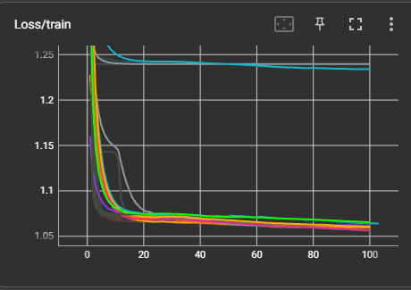 | 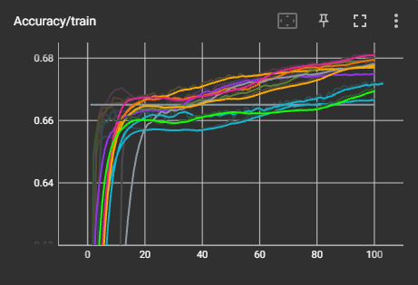 |
| 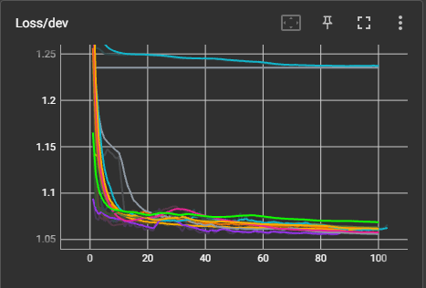 | 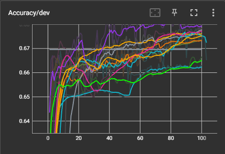 |

#### Final Evaluation on the test set
| Loss   | Accuracy |
|:------:|:--------:|
| 1.7224 | 0.67     |

### Evaluation
Not much time will be spent evaulating this model. In short, its performance was very much in line with the rest of the models. It was by no means the best of the existing models, in fact it was one of the lower performing ones (for this version), but the differences, as always, fell well within the margin of error we can expect for these models.

v5.1 will look dramatically different, as I'll be testing if leveraging more features from the new data source proves helpful.


## v5.1
This verison aims to see how far a larger featureset and more robust model can take this project.

### Data

#### Changes
Seven new columns have been added, bringing the total number of features to 11.
1. Exit Velocity
2. Z-axis Launch Angle
3. XY-axis Launch Angle (horizontal launch angle)
4. Pitch Velocity
5. Pitcher Arm (left/right)
6. Batting Side (left/right)
7. Zone (numbers zone of where the ball roughly crossed the plate)
8. Release Spin Rate
9. Feet per Second (batter speed)
10. Infield Alignment
11. Outfield Alignment

#### Classes
Remains the same as [v2.1](#classes-2).

#### Distribution
Remains the same as [v5.0](#distribution-5).

#### Split
The same as [v2.1](#split-2).

### Neural Network
| Layer | Input Nodes | Output Nodes | Function |
|:-----:|:-----------:|:------------:|----------|
| 1     | 11          | 32           | ReLU     |
| 2     | 32          | 64           | ReLU     |
| 3     | 64          | 128          | ReLU     |
| 4     | 128         | 128          | ReLU     |
| 5     | 128         | 64           | ReLU     |
| 6     | 64          | 32           | ReLU     |
| 7     | 32          | 4            | Softmax  |

### Hyperparameters
| H-param       | Value              |
|---------------|--------------------|
| Split         | 80/10/10           |
| Loss          | Cross Entropy Loss |
| Optimizer     | Adam               |
| Learning Rate | 3e-3               |
| Epochs        | 1,000              |
| Batch Sizes   | 1,000              |
| Weight Decay  | 1e-4               |
| Scheduler     | OneCycleLR         |
| Max LR        | 1e-2               |

### Training
After 1,000 epochs, there were dramatic improvements in the model. The loss of both the dev set and the training set improved by ~6%, compared to the previous best performing model, and accuracy for both improved ~7%.

(v5.1 is the light blue line. The purple line is [v4.1](#v41) (the best performing model up to this point).)
| Loss | Accuracy |
|:----:|:--------:|
| 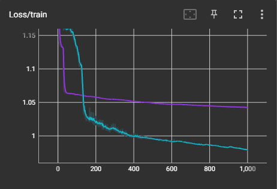 | 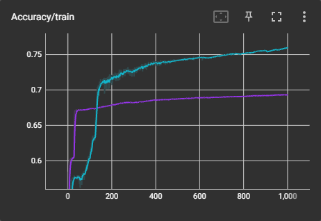 |
| 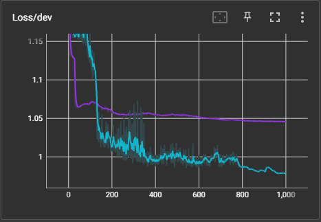 | 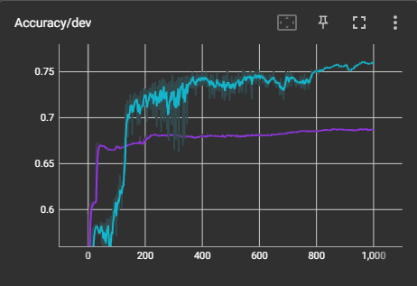 |

#### Final Evaluation on the test set
| Loss   | Accuracy |
|:------:|:--------:|
| 1.1501 | 0.76     |

### Evaluation
This was, by far, the best largest improvement to the model in many iterations and it finally pushed it over that 70% threshold and then some. I am very pleased with the development and particularly the fact that the majority of improvements occurred around non-HR XBHs (from ~53% accuracy to 74.66%). Couple this with the fact that there are no obvious signs of bias, overfitting, etc. and the model is in a very strong position moving forward.

| Label      | Total Samples | Accuracy |
|------------|:-------------:|:--------:|
| field_out  | 6,858         | 70.59%   |
| single     | 7,091         | 75.81%   |
| non_hr_xbh | 6,842         | 74.66%   |
| home_run   | 4,439         | 86.71%   |

This major development does have one flaw to it. In my over-zealousness to test out the new data source, a lot of changes were implmented in a single iteration, meaning it is somewhat more difficult to tease out which changes actually impacted the model the most. A few things to consider on this front:
1. There was a dramatic sample size increase, which could have played a big role in helping the model learn.
2. Epochs were increased from 100 to 1,000 compared to v5.0. Since v5.1 didn't pass v5.0 in performance until step 134, increased training time certainly played a role in the improvements.
3. Three additional layers were added to the model and subsequently more nodes per layer. A reasonble explanation for part of the performance boost is that the added complexity of the model took better advantage of item #4's change.
4. Seven new features were added. One of the more obvious potential reasons for model improvement. These curated features definitely played a role in model performance, but which ones and to what degree have yet to be determined.