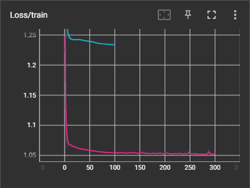

# Predict At Bat Outcomes
Baseball has always been a cutting edge sport in regards to analytics. More and more predictive analytics is being used to improve player performance and team decision making. In the spirit of that, this project aims to give better insight on the quality of a hit by training a neural network to predict the outcome of an at bat, based on the pitch velocity, exit velocity, and launch angle.

# Table of Contents
1. [Data](#data)
2. [Models](#models)
    1. [v1.0](#v10)
    2. [v2.0](#v20)
    3. [v2.1](#v21)

# Data
The dataset is every player who was active in 2020's at bats from 2015 - 2020. This totals 778,449 rows of data, almost all of which are very high quality. The data was acquired via another program I've written, that scrapes baseball statistics off of various sites ([mlb.com](https://www.mlb.com), [fangraphs](https://www.fangraphs.com), [baseballsavant](https://www.baseballsavant.mlb.com), etc.) and saves them for later use. These particular statistics (pitch velo, exit velo, and launch angle) were scraped from [baseballsavant](https://www.baseballsavant.mlb.com).

# Models
This model has been through multiple iterations. Each iteration trained on either the entire or a subset of the data described above, then training and error analysis were performed to identify areas of improvement. These improvements were implemented and the model was trained again.

## v1.0
This, the first end-to-end training of the model, had a very simple structure to it, in order to get a clearer idea of the most effective direction to go next.

### Data

#### Changes
Very little was done to the data for this exploratory iteration.

- Smaller quantity columns like `fielders_choice` and `triple_play` were rolled up into `field_out`.
- Since the goal is to classify batted balls, all no-contact plays were droped (strikeouts, walks, etc.).
- The data was all normalized on the training set's mean and standard deviation, to improve training times and quality.

#### Classes
This left the data with 536,712 rows and five unique labels:
- field_out
- single
- double
- triple
- home_run

#### Distribution
A known issue going into this iteration is that the distribution of the data is **heavily** skewed. Two thirds of the data are labeled `field_out` on the high end and on the low end `triple` made up 0.7% of the data. The expectation is this will create heavy bias, potentially even reducing multiple labels to zero predictions.

#### Split
The data was split 90/5/5 between the train, dev, and test sets.

### Neural Network
| Layer | Input Nodes | Output Nodes | Function |
|:-----:|:-----------:|:------------:|----------|
| 1     | 3           | 32           | ReLU     |
| 2     | 32          | 64           | ReLU     |
| 3     | 64          | 128          | ReLU     |
| 4     | 128         | 128          | ReLU     |
| 5     | 128         | 64           | ReLU     |
| 6     | 64          | 32           | ReLU     |
| 7     | 32          | 5            | Softmax  |

### Hyperparameters
| H-param       | Value              |
|---------------|--------------------|
| Split         | 90/5/5             |
| Loss          | Cross Entropy Loss |
| Optimizer     | Adam               |
| Learning Rate | 0.001              |
| Epochs        | 100                |
| Batch Sizes   | 3,000              |

### Training
After training for 100 epochs, the training loss flattened out almost immediatley and all of the dev loss, dev accuracy, and train accuracy did not change at all.

| Loss | Accuracy |
|:----:|:--------:|
|  |  |
|  |  |

#### Final Evaluation on the test set
| Loss   | Accuracy |
|:------:|:--------:|
| 0.9048 | 0.66     |

### Evaluation
It is immediately apparent that there is some fundamental flaw with this iteration and only a little more digging reveals the truth. For almost every row of data, train, dev, or test, the model predicted `field_out`. Unsurprisingly, this gave the model ~0.66 accuracy for each dataset, since field outs make up two thirds of the data.

While there are other obvious areas to improve the model, it seems data distribution is by far the most pressing issue, as it will measurably impact every future model if not dealt with first. It also eschews the need to continue evaluating this model by other means (precision, recall, etc.), because there is not point overwhelming the second iteration with "to-do's".

The one benefit of this result is it begins to elucidate the target goal. Since there is no data evaluated by other means (eg. how well a heuristic model performs or how well a human can perform the task), this project lacks a "true" target goal of performance. At least now it is clear that one of the worst possible models will be correct 2 out of 3 times.

## v2.0
This iteration aims to shed more light on the best solution for the data distribution problem uncovered by [v1.0](#v10).

### Data

#### Changes
Because of the heavy skewness towards field outs and singles, in the original dataset (which in the context of baseball makes sense, but severely hurts modeling), this version aims to remedy the problem by redistributing the data, at the cost of a reduction of total samples.

- The same initial cleaning steps were taken as in [v1.0](#v10)
- Random samples labeled `field_out` or `single` were removed until each label had no more than 40,000 samples.
    - This reduced the total sample size from ~500,000 rows to ~146,000.

#### Classes
Remained the same five classes as [v1.0](#classes)

#### Distribution
With the data redistributed, as outlined above, the data is much more inline with acceptable distribution expections. Field outs and singles make up 27% of the data each, while doubles are 25% and home runs 18%. Triples are still the noticeable outlier at 2.5%, but that will be addressed after the impact of this redistribution can be measured.

#### Split
With the loss of a fair bit of data, the split was updated to be more accomodating to 80/10/10.

### Neural Network
| Layer | Input Nodes | Output Nodes | Function |
|:-----:|:-----------:|:------------:|----------|
| 1     | 3           | 32           | ReLU     |
| 2     | 32          | 64           | ReLU     |
| 3     | 64          | 128          | ReLU     |
| 4     | 128         | 128          | ReLU     |
| 5     | 128         | 64           | ReLU     |
| 6     | 64          | 32           | ReLU     |
| 7     | 32          | 5            | Softmax  |

### Hyperparameters
| H-param       | Value              |
|---------------|--------------------|
| Split         | 80/10/10           |
| Loss          | Cross Entropy Loss |
| Optimizer     | Adam               |
| Learning Rate | 0.001              |
| Epochs        | 100                |
| Batch Sizes   | 1,000              |

### Training
After training for 100 epochs, the model showed a much more expected progressions in both train and dev loss/accuracy. The margins are very small for the following, but training loss/acc both surpassed v1.0, but dev did not.

| Loss | Accuracy |
|:----:|:--------:|
|  |  |
|  |  |

#### Final Evaluation on the test set
| Loss   | Accuracy |
|:------:|:--------:|
| 0.9048 | 0.67     |

### Evaluation
The results seem nearly identical at first glance (the losses are identical and the accuracies only have a 0.01 difference), but this model was much more encouraging to see than v1.0.

The first positive sign are the loss and accuracy graphs shown above. They indicate that the model was actually learning each epoch and may have continued learning if training was extended. That being said, learning was slow, which is something worth looking into in the future.

The second piece of good news was the labeling of the test dataset. Rather than 100% of predictions being field outs, we have the below distribution:

| Label     | Total Samples | Accuracy |
|-----------|:-------------:|:--------:|
| field_out | 3,988         | 71.61%   |
| single    | 4,013         | 69.75%   |
| double    | 3,628         | 49.72%   |
| home_run  | 2,618         | 89.08%   |
| triple    | 344           | 0.0%     |

This reaffirms the information gotten from the loss graphs, that the model was actually learning to label. It also provides insight on next steps.

First is the question of triples. There are simply so few of them and they are very similar to doubles, that in their current state it will be very hard to get the model to learn them. It's impractical reduce the rest of the results down to the triple level, like done with11 field outs and singles, which leaves: synthetic samples, combining them with another label, removing them, or more data.

More data is going to be a time-intensive task and, even though it might be the option that could show the most improvement (since triples are heavily tied to player speed), the time required to get the data might not be worth improving the least common hit. Synthetic samples *might* show some improvement, but again, they're very similar to doubles, so this might be only a very small improvement or just confuse doubles. Removing them is not an unreasonable option and it would eliminate any issue they might have, but combining them to doubles and changing the label to something akin to "non_hr_xbh", might be the best option for the model long term and prevent us from losing more samples.

The other key insight this version gives us is that we need to increase learning speed, but to prevent oscillation around the minima, we should implement momentum or something similar in tandem with increasing learning rate (Adam already being used may be enough, but that will have to be tested).

## v2.1
This iteration will measure the effects of combining doubles and triples and increasing training to 300 epochs.

### Data

#### Changes
As mentioned in the [v2.0 evaluation](#evaluation-1), doubles and triples will be combined into `non_hr_xbh`. No other changes will be made to the data, in order to measure the effects.

- The same initial cleaning steps were taken as in [v1.0](#v10) and [v2.0](#v20)
- Results equal to `triple` were renamed to `double`, then `double` was renamed to `non_hr_xbh`.

#### Classes
With triples and doubles combined, now there are only 4 labels.
- field_out
- single
- non_hr_xbh
- home_run

#### Distribution
Non-HR XBHs now make up 27% of the data, which makes that label equal in size to field outs and singles, with home runs still at 18%.

#### Split
The same as [v2.0](#v20) 80/10/10.

### Neural Network
| Layer | Input Nodes | Output Nodes | Function |
|:-----:|:-----------:|:------------:|----------|
| 1     | 3           | 32           | ReLU     |
| 2     | 32          | 64           | ReLU     |
| 3     | 64          | 128          | ReLU     |
| 4     | 128         | 128          | ReLU     |
| 5     | 128         | 64           | ReLU     |
| 6     | 64          | 32           | ReLU     |
| 7     | 32          | 5            | Softmax  |

### Hyperparameters
| H-param       | Value              |
|---------------|--------------------|
| Split         | 80/10/10           |
| Loss          | Cross Entropy Loss |
| Optimizer     | Adam               |
| Learning Rate | 0.001              |
| Epochs        | 300                |
| Batch Sizes   | 1,000              |

### Training
After training for 300 epochs, the model showed measured improvements over v2.0, albeit on a small scale. The majority of improvements happened early, making the difference of adding 200 additional epochs negligible.

(pink=v2.1; blue=v2.0)
| Loss | Accuracy |
|:----:|:--------:|
|  |  |
|  |  |

#### Final Evaluation on the test set
| Loss   | Accuracy |
|:------:|:--------:|
| 1.6680 | 0.68     |

### Evaluation
This minor update proved to be another step in the right direction. As seen above, the train/dev loss/acc all markedly improved over v2.0. That being said, there are some takeaways that require attention.

1. The test loss was 1.6680, higher than any other version and 0.5 greater than the train and dev losses.

This could indicate potential bias, but also because the dev loss was inline with the training results and tests accuracy was consistent with train, there's a possibility this was an abberation and training again might produce more acceptable results.

2. The improvements, while good, are still marginal.

This isn't wholly unsurprising, because the only change was combining doubles and triples. At most (because triples made up 2.5% of the labels), accuracy could improve by 0.025, so the 0.01... change seen is in line with that expectation.

This being said, marginal improvements shouldn't be the goal. It's time to focus more are larger gains, which may mean next iteration will be learning rate focused.

3. Non-HR XBHs still face a labeling problem.

Looking at the below test accuracies, non-HR XBHs are the worst performer at ~50% accurate.

| Label      | Total Samples | Accuracy |
|------------|:-------------:|:--------:|
| field_out  | 4,002         | 76.84%   |
| single     | 4,022         | 67.73%   |
| non_hr_xbh | 3,935         | 50.62%   |
| home_run   | 2,632         | 83.02%   |

Improving that number should be a priority, since home runs are in a very strong spot and singles/field outs are expected to have a harder time at telling each other apart. This means following iterations will need to dive deeper into which non-HR XBHs are having the most issues and why.

4. Moving forward, while looking for areas of improvement, the possibility of already being near the ceiling needs to be entertained.

While not a scenario anyone would want, the possibility that 65-70% accuracy being the best this model will ever be able to achieve with this data is real. With only three features (pitch velo being one I'm not confident actually helps the model), lack of robust features may be the biggest blocker this model faces. Player speed, horizontal launch angle, park, opposing defense, etc. are all potentially helpful features for this model that will either take a lot of time to gather or are simply not available to the public. Trying to improve the model in other, less time-intensive ways is the correct approach for now, but it is smart to continue assessing the situation so that efforts are not in vain.

The next version will focus most on improving #2, #3, or both as those seem like the biggest potential improvement areas right now.
